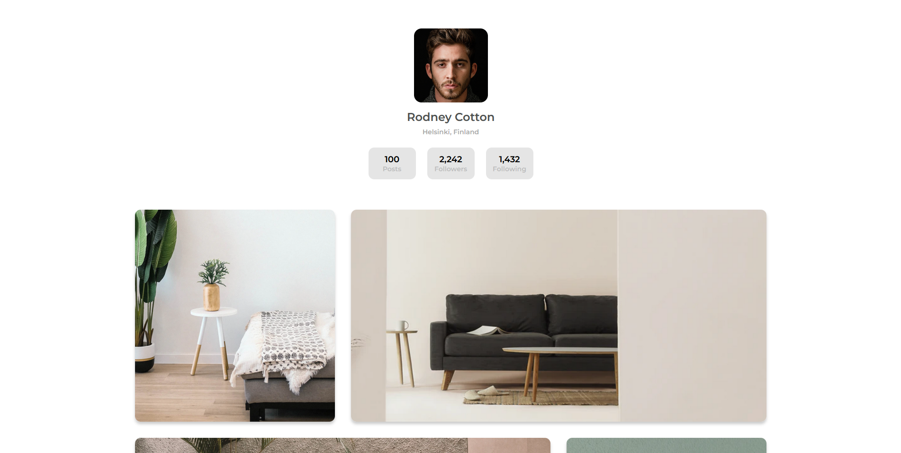

<!-- Please update value in the {}  -->

<h1 align="center">My Gallery</h1>

   Solution for a challenge from  <a href="http://devchallenges.io" target="_blank">Devchallenges.io</a>.

  <h3>
    <a href="https://my-gallery-tm.netlify.app/">
      Demo
    </a>
     | 
    <a href="https://devchallenges.io/solutions/4d4793j4mcoGhAIoovA9">
      Solution
    </a>
     | 
    <a href="https://devchallenges.io/challenges/gcbWLxG6wdennelX7b8I">
      Challenge
    </a>
  </h3>

<!-- TABLE OF CONTENTS -->

## Table of Contents

- [Overview](#overview)
  - [Built With](#built-with)
- [Features](#features)
- [Contact](#contact)

<!-- OVERVIEW -->

## Overview

### Built With

<!-- This section should list any major frameworks that you built your project using. Here are a few examples.-->

- HTML
- CSS

## Features

<!-- List the features of your application or follow the template. Don't share the figma file here :) -->

This application/site was created as a submission to a [DevChallenges](https://devchallenges.io/challenges) challenge. The [challenge](https://devchallenges.io/challenges/TtUjDt19eIHxNQ4n5jps) was to build an application to complete the following user stories:

- [x] **User story:** I can see a page following the given design

## Contact

- GitHub [@your-username](https://github.com/marinactonci)
